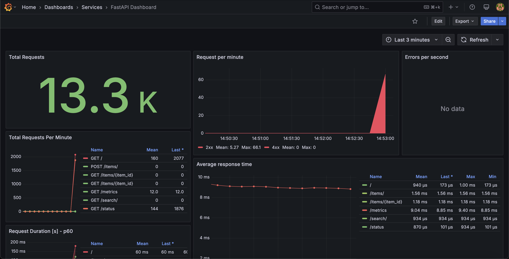

# FastAPI Observability Dashboard

This project demonstrates a FastAPI application integrated with a comprehensive observability stack using Prometheus, Grafana, and Loki, all managed via Docker Compose.


## Overview

The setup includes:
* A simple **FastAPI** application (`the-app`) with several example endpoints and built-in metrics exposure (`/metrics`)[cite: 1].
* **Prometheus** (`prometheus-observer`) for scraping and storing metrics from the FastAPI application[cite: 1].
* **Grafana** (`grafana-observer`) for visualizing metrics from Prometheus and logs from Loki. It includes a provisioned dashboard specifically for the FastAPI application[cite: 1].
* **Loki** (`loki-observer`) for log aggregation[cite: 1].
* **Promtail** (`promtail-observer`) for collecting logs from Docker containers (specifically `the-app`) and sending them to Loki[cite: 1].

## Features

* **Metrics Collection:** FastAPI app exposes Prometheus metrics via `/metrics` using `prometheus-fastapi-instrumentator`. Prometheus scrapes this endpoint.
* **Log Aggregation:** Promtail tails Docker container logs and pushes them to Loki.
* **Visualization:** Grafana provides dashboards to view metrics (Prometheus datasource) and logs (Loki datasource).
* **Containerized:** All services run in Docker containers orchestrated by Docker Compose[cite: 1].
* **Load Testing:** Includes a k6 script (`stress_test.js`) to generate load against the FastAPI application.

## Directory Structure
Okay, here is a README.md file generated based on the structure and content of your fastapi-observability-dashboard project.
Markdown

# FastAPI Observability Dashboard

This project demonstrates a FastAPI application integrated with a comprehensive observability stack using Prometheus, Grafana, and Loki, all managed via Docker Compose.

## Overview

The setup includes:
* A simple **FastAPI** application (`the-app`) with several example endpoints and built-in metrics exposure (`/metrics`)[cite: 1].
* **Prometheus** (`prometheus-observer`) for scraping and storing metrics from the FastAPI application[cite: 1].
* **Grafana** (`grafana-observer`) for visualizing metrics from Prometheus and logs from Loki. It includes a provisioned dashboard specifically for the FastAPI application[cite: 1].
* **Loki** (`loki-observer`) for log aggregation[cite: 1].
* **Promtail** (`promtail-observer`) for collecting logs from Docker containers (specifically `the-app`) and sending them to Loki[cite: 1].

## Features

* **Metrics Collection:** FastAPI app exposes Prometheus metrics via `/metrics` using `prometheus-fastapi-instrumentator`. Prometheus scrapes this endpoint.
* **Log Aggregation:** Promtail tails Docker container logs and pushes them to Loki.
* **Visualization:** Grafana provides dashboards to view metrics (Prometheus datasource) and logs (Loki datasource).
* **Containerized:** All services run in Docker containers orchestrated by Docker Compose[cite: 1].
* **Load Testing:** Includes a k6 script (`stress_test.js`) to generate load against the FastAPI application.

## Directory Structure

.
├── docker-compose.yaml         # Main Docker Compose file
├── Dockerfile                  # Defines the FastAPI application image (implied)
├── main.py                     # FastAPI application source code
├── requirements.txt            # Python dependencies for FastAPI app
├── stress_test.js              # k6 load test script
├── locust.py                   # Locust load test script (optional)
├── grafana/
│   └── provisioning/
│       ├── datasources/        # Grafana datasource configurations (Loki, Prometheus)
│       │   ├── datasource.yml
│       │   └── loki-datasource.yml
│       └── dashboards/         # Grafana dashboard configurations
│           ├── dashboard.yml
│           └── fastapi-dashboard.json
├── loki/
│   └── config.yml              # Loki configuration file
├── prometheus/
│   └── prometheus.yml          # Prometheus configuration file
└── promtail/
└── config.yml              # Promtail configuration file

## Prerequisites

* Docker ([Install Docker](https://docs.docker.com/engine/install/))
* Docker Compose ([Install Docker Compose](https://docs.docker.com/compose/install/))

## Setup and Running

1.  **Create External Docker Network:**
    The services communicate over a shared Docker network named `monitoring`. Create it if it doesn't exist:
    ```bash
    docker network create monitoring
    ```

2.  **Build and Start Services:**
    Navigate to the project's root directory (where `docker-compose.yaml` is located) and run:
    ```bash
    docker compose up -d --build
    ```
    * `--build`: Ensures the FastAPI application image (`the-app`) is built using the `Dockerfile`.
    * `-d`: Runs the containers in detached mode (in the background).

3.  **Stop Services:**
    To stop the running services:
    ```bash
    docker compose down
    ```

## Accessing Services

Once the containers are running, you can access the services via your browser:

* **FastAPI Application:** [http://localhost:5060](http://localhost:5060) [cite: 1]
* **FastAPI Metrics:** [http://localhost:5060/metrics](http://localhost:5060/metrics)
* **Grafana:** [http://localhost:3000](http://localhost:3000) (Login: admin/admin) [cite: 1]
* **Prometheus:** [http://localhost:9090](http://localhost:9090) [cite: 1]
* **Loki:** (Usually accessed via Grafana, but API is at port 3100) [cite: 1]
* **Promtail:** (Runs as an agent, typically no UI access needed) [cite: 1]

## Load Testing

A k6 script (`stress_test.js`) is included to simulate traffic against the FastAPI application.

1.  **Install k6:** Follow the instructions at [k6.io](https://k6.io/docs/getting-started/installation/).
2.  **Run the test:**
    ```bash
    k6 run stress_test.js
    ```
    You should see metrics and logs populate in Grafana as the test runs.

## Configuration

* **FastAPI:** Configuration is within `main.py` and dependencies in `requirements.txt`. The application runs on port 5060 internally[cite: 1].
* **Prometheus:** Configured in `prometheus/prometheus.yml` to scrape itself and the `the-app:5060` target.
* **Loki:** Configured in `loki/config.yml`.
* **Promtail:** Configured in `promtail/config.yml` to read Docker socket logs and send to `loki-app:3100`.
* **Grafana:** Datasources and dashboards are provisioned via files in `grafana/provisioning/`.
